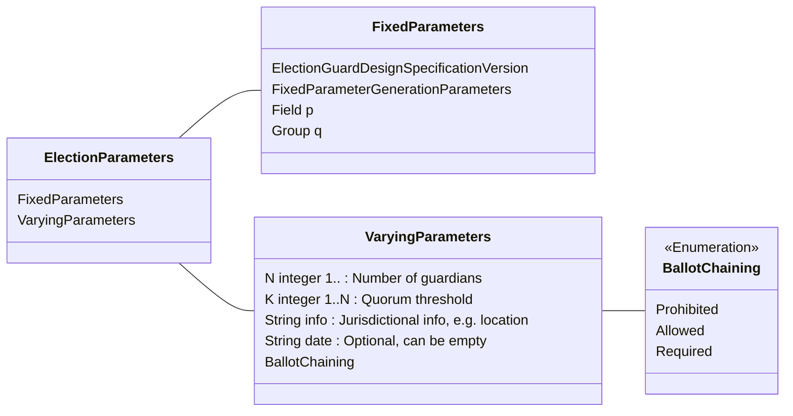
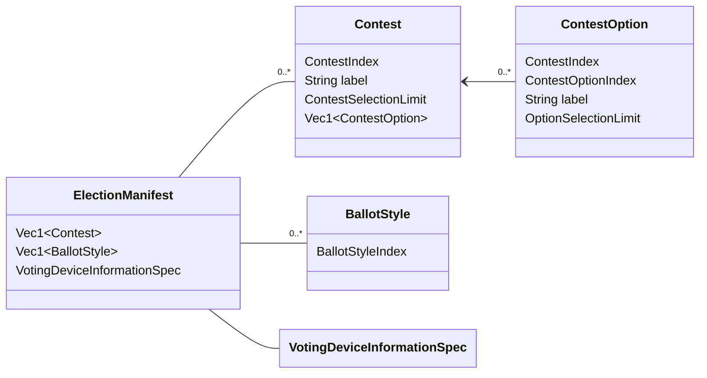
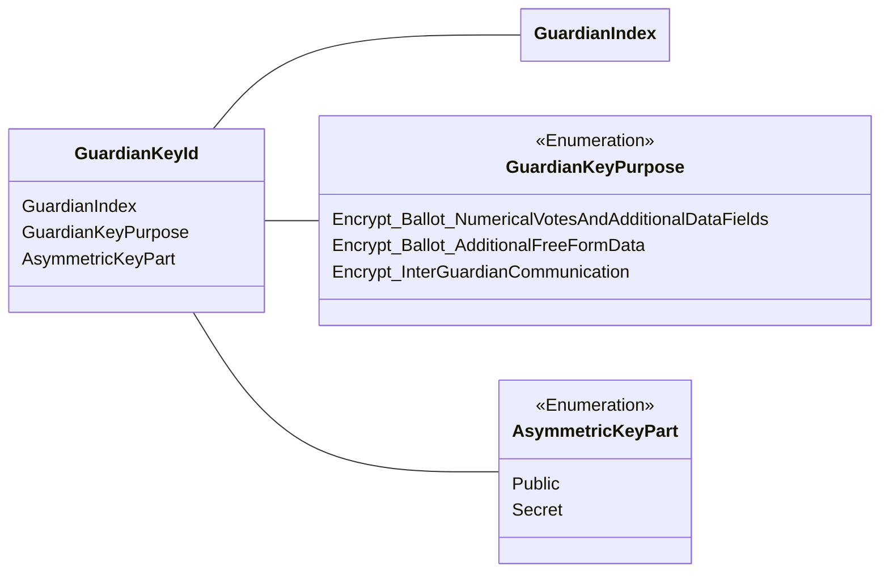
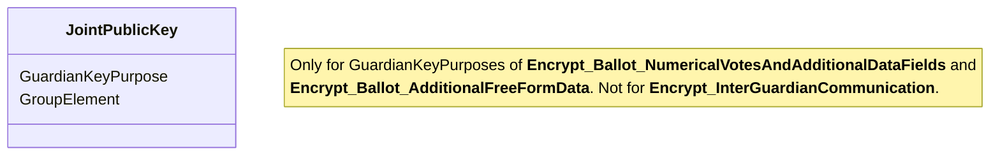
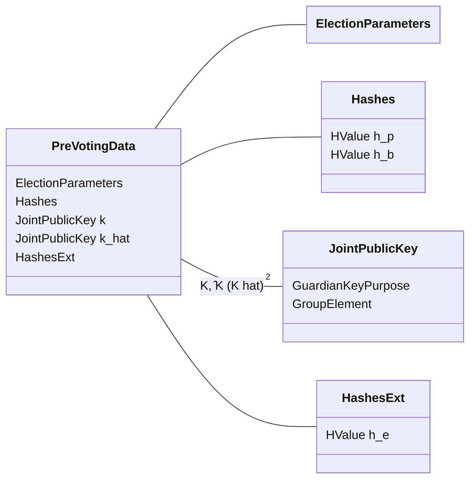
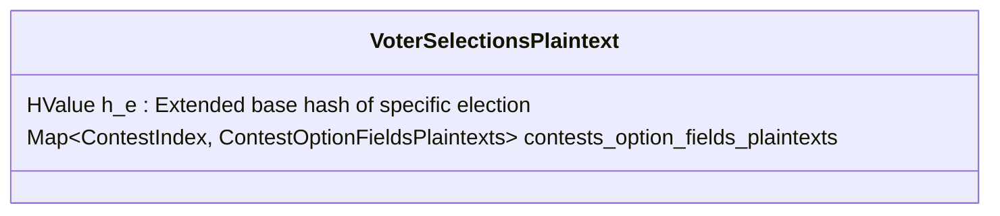
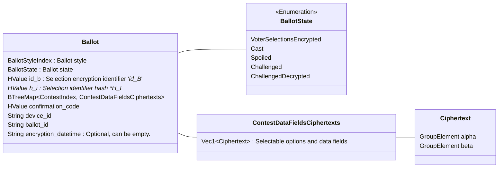
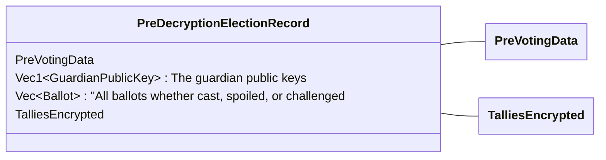
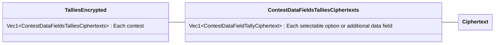
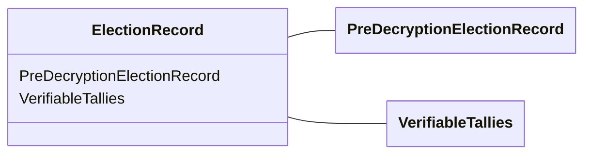

# ElectionGuard 2.1 - Reference Implementation in Rust - Code Organization

## Election Data Objects

### Election Parameters

### Election Manifest

### Guardian Keys

### Joint Public Keys

### Pre-Voting Data

### Voter Selections (plaintext)

### Ballot (encrypted)

### Pre-Decryption Election Record

### Post-Decryption Election Record

