# ElectionGuard 2.1 - Reference Implementation in Rust - Code Organization

## Election Data Objects

### Election Parameters

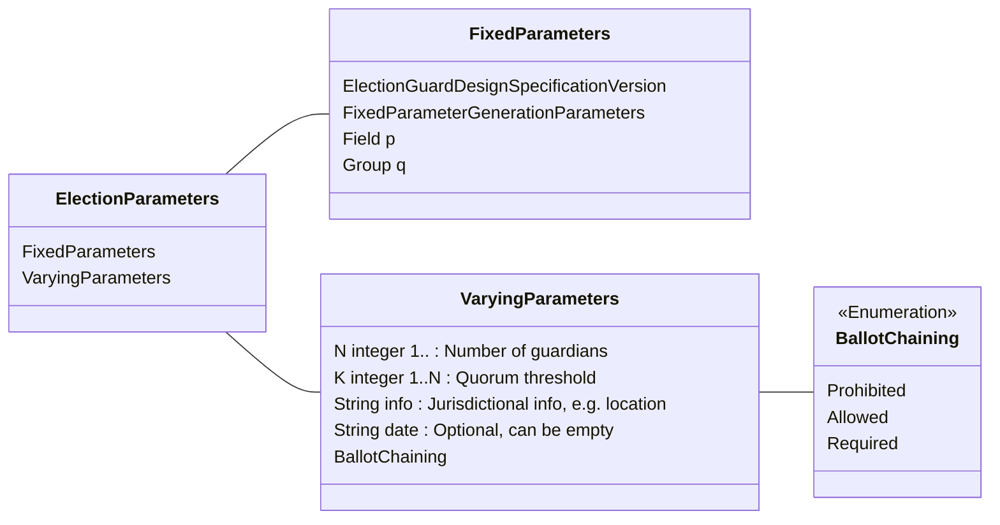

### Election Manifest

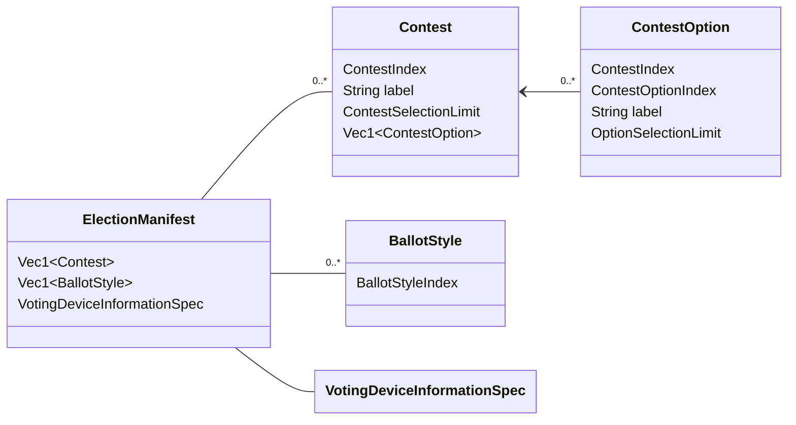

### Guardian Keys

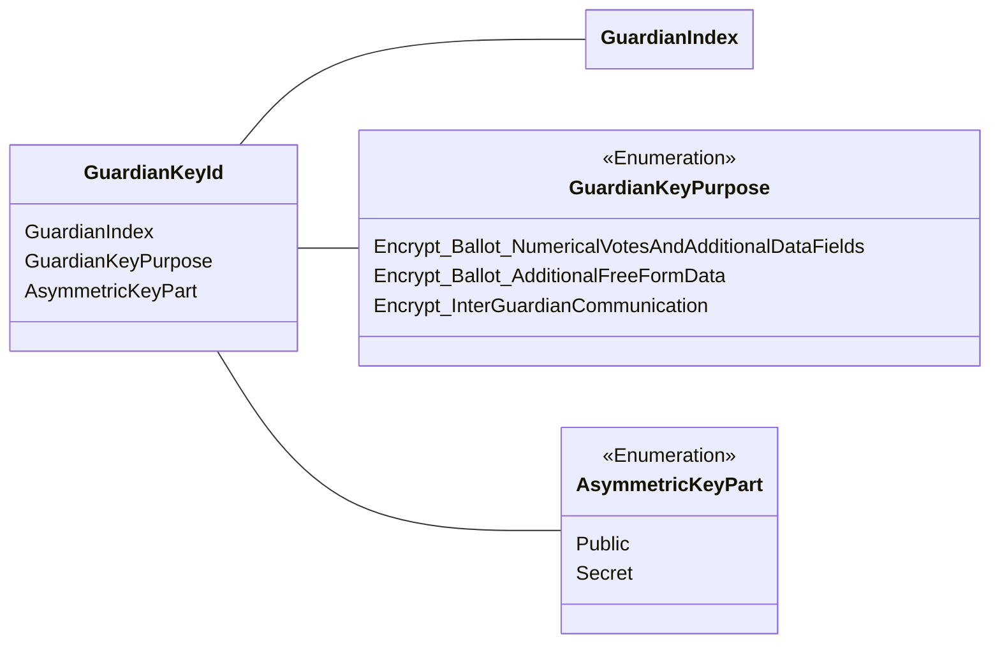

### Joint Public Keys

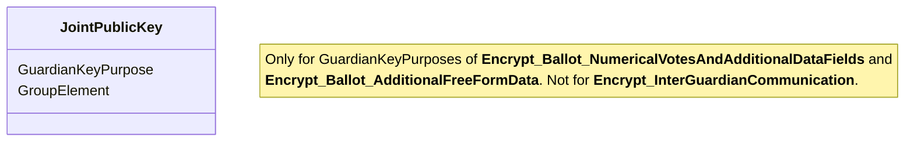

### Pre-Voting Data

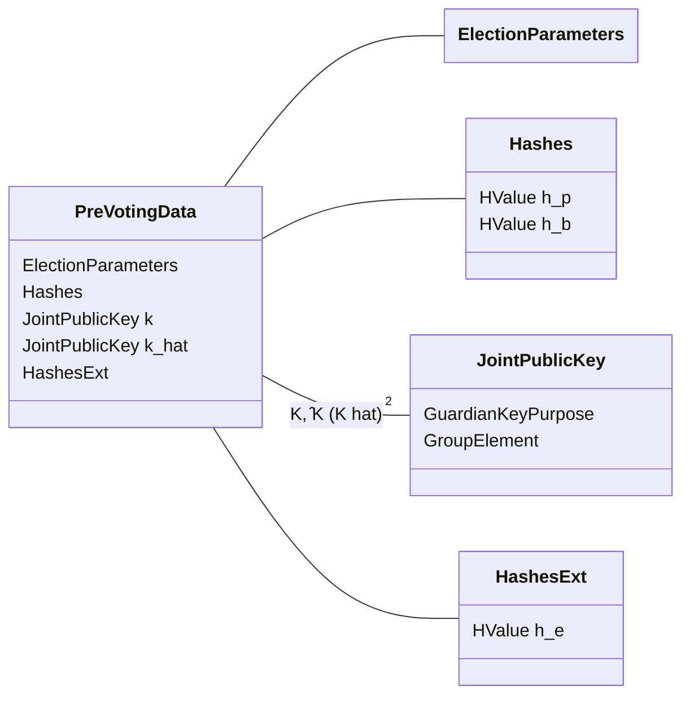

## Glossary

This describes the terms as they are used in this implementation, which may or may not correspond
exactly to the term as used by other election systems.

See also the [ElectionGuard Glossary](
https://www.electionguard.vote/overview/Glossary/
) at electionguard.vote, which explicitly aims to conform with NIST CDF.

### InterGuardianCommunicationSecretKey

Created:
- before or during the Key ceremony

Category:
- secret held by a Guardian

Particular to:
- a Guardian identity, possibly independent of any Election

\zeta_i in EGDS v2.1.0 eq. 9. on pg. 23.

### GuardianSecretCoefficients

Created:
- before or during the Key ceremony

Category:
- secret held by a Guardian

Particular to:
- a Guardian identity, possibly independent of any Election
- choice of decryption quorum size (election parameter K)
- a usage, either
  * "K" encryption of (homomorphically-tallied) votes, or
  * "K_hat" encryption of other (not homomorphically-tallied) data

a_{i,j} (or \hat{a}_{i,j}) in EGDS v2.1.0 on pg. 22 before eq. 7.

### GuardianCoefficientCommitments

Created:
- before or during the Key ceremony

Category:
- published to ElectionRecord

Particular to:
- a Guardian identity, possibly independent of any Election
- choice of decryption quorum size (election parameter K)
- a usage, either
  * "K" encryption of (homomorphically-tallied) votes, or
  * "K_hat" encryption of other (not homomorphically-tallied) data

Particular to:
- a Guardian identity
- either K (vote encryption) or K_hat (other data encryption)
- SecretCoefficients
- InterGuardianCommunicationSecretKey "kappa"

Verified by:
- Verification 2 (Guardian public-key validation) EGDS v2.1.0 pg. 24.

K_{i,j} (or \hat{K}_{i,j}) in EGDS v2.1.0 eq. 8. on pg. 22.

### CoefficientProofs

Created:
- before or during the Key ceremony

Category:
- published to ElectionRecord

Particular to:
- a Guardian identity, possibly independent of any Election
- a usage, either
  * "K" encryption of (homomorphically-tallied) votes, or
  * "K_hat" encryption of other (not homomorphically-tallied) data
- a set of SecretCoefficients
- InterGuardianCommunicationSecretKey "kappa"

Verified by:
- Verification 2 (Guardian public-key validation) EGDS v2.1.0 pg. 24.

(c_i, v_{i,0<=j<k}) and u_{i,0<=j<k} (or \hat{c}, \hat{v}, \hat{u}) in EGDS v2.1.0 eq. 10-11. on pg. 23.

### JointPublicKey

Created:
- during the Key ceremony

Category:
- published to ElectionRecord

Particular to:
- a set of GuardianCoefficientCommitments ("Guardians")
- a usage, either
  * "K" encryption of (homomorphically-tallied) votes, or
  * "K_hat" encryption of other (not homomorphically-tallied) data

Verified by:
- Verification 3 (Election public-key validation) EGDS v2.1.0 pg. 26.

K [EGDS v2.1.0 eq. 25 pg. 26], or \hat{K} [EGDS v2.1.0 eq. 26 pg. 26].

### GuardianToGuardianKeyShareCiphertext

Created:
- during the key ceremony

Category:
- encrypted
- not published in election record
- may be made public under some circumstances
- part of secret held by a Guardian

Particular to:
- a key ceremony
- `N` sets of `K` SecretCoefficients
- a 'sender' Guardian identified by its 1-based index
- a 'receiver' Guardian identified by its 1-based index
- a usage, either
  * "K" encryption of (homomorphically-tallied) votes, or
  * "K_hat" encryption of other (not homomorphically-tallied) data

A share of Guardian i's secret coefficents encrypted
(C_{i,\ell,0},C_{i,\ell,1},C_{i,\ell,2}) in EGDS v2.1.0 eq. 15-22. on pg. 25.

### GuardianSecretKeyShare

Created:
- during the key ceremony

Category:
- secret held by a Guardian

Particular to:
- a key ceremony
- `N` sets of `K` SecretCoefficients
- a Guardian
- a usage, either
  * "K" encryption of (homomorphically-tallied) votes, or
  * "K_hat" encryption of other (not homomorphically-tallied) data

A Guardian's share of the vote or ballot data
z_i = P(i) in EGDS v2.1.0 eq. 23. on pg. 26.

### VoterSelections

Created:
- during voting
- from voter-supplied information

Category:
- confidential plaintext, temporary
- produced within a voting device
- erased after creation of Ballot by encryption
- may be reconstructed by a quorum of Guardians (or SecretCoefficients or GuardianShares) from the ElectionRecord

Particular to:
- an ElectionManifest
- a BallotStyle
- creation of a Ballot

### Ballot

Created:
- during voting
- by encrypting VoterSelections

Category:
- published to ElectionRecord

Particular to:
- an election: ExtendedBaseHash, ElectionManifest, Joint{Vote|Data}PublicKey
- a BallotStyle
- set of VoterSelections supplied to a VotingDevice

In this implementation, all things called "Ballots" contain only encrypted ciphertexts.
There is no concept of a "plaintext ballot" (that's VoterSelections), or a "blank ballot"
(cf. PreencryptedBallot).

### Voter Selections (plaintext)

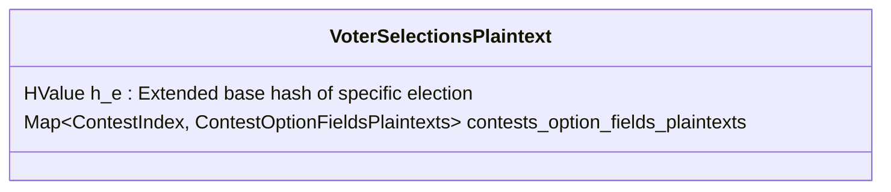

### Ballot (encrypted)

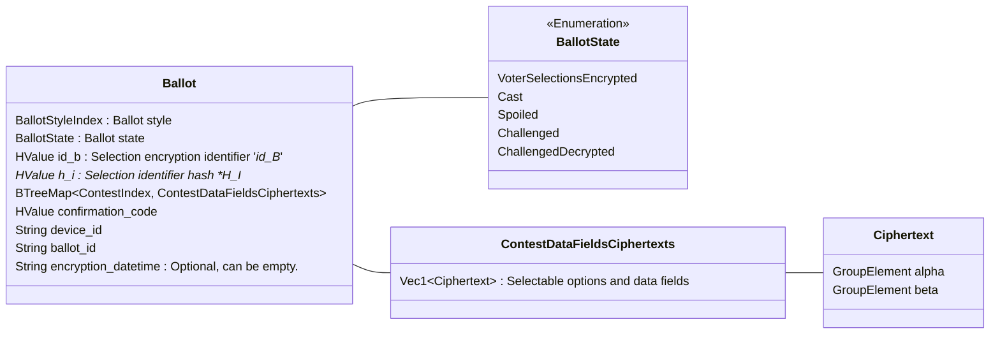

### Pre-Decryption Election Record

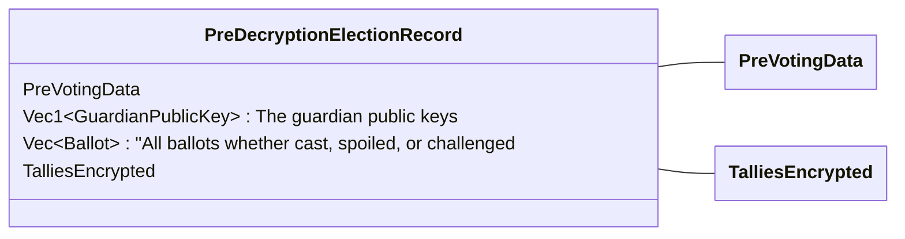

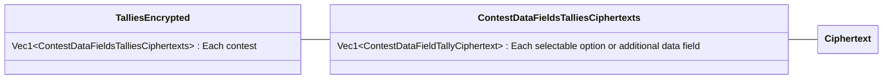

### Post-Decryption Election Record

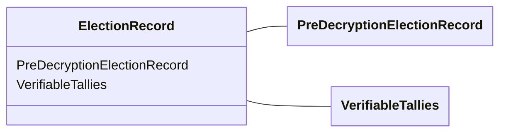

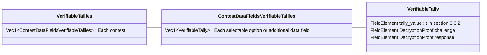
